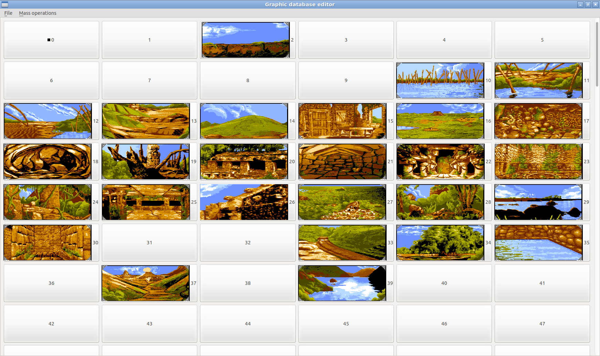

NAPS - The New Age PAW-like System - Herramientas para sistemas PAW-like
========================================================================

Tabla de contenidos
-------------------

- [Introducción](#introducción)
- [Intérprete PAW-like](#intérprete-paw-like)
- [Entorno de desarrollo integrado (IDE)](#entorno-de-desarrollo-integrado-ide)
- [Editor de bases de datos gráficas](#editor-de-bases-de-datos-gráficas)
- [Instalación de los requisitos en Windows](#instalación-de-los-requisitos-en-windows)
- [Agradecimientos](#agradecimientos)

Introducción
------------

NAPS es un conjunto de herramientas para aventuras conversacionales de muchas plataformas, para poder ejecutarlas de forma nativa (sin necesidad de emulador); y también para desarrollarlas. Su soporte de sistemas de aventuras conversacionales es principalmente los sistemas de la familia de The Quill, de Gilsoft: The Quill, PAWS, SWAN y DAAD; pero aparte también soporta aventuras del sistema GAC.

Intérprete PAW-like
-------------------

")

")

")

**Requisitos:**

- Python versión 2.X superior a 2.5, ó 3.X superior a 3.2
- Recomendado: PyGame versión 1.X ó 2.X (necesario para que tenga interfaz gráfica)
- Opcional: PyQt versión 4.X ó 5.X (necesario para el diálogo de elección de fichero o carpeta que se desea ejecutar)

**Modo de uso básico:**

Hacer doble click sobre ``interprete.py`` en caso de tener instalados los requisitos (necesitarás tener instalado también PyQt para utilizar el intérprete de esta manera), o bien sobre ``Intérprete NAPS.bat`` en caso de disponer de la versión portable para Windows de NAPS.

Acto seguido, se mostrará un diálogo pidiendo que selecciones lo que deseas ejecutar, de entre las siguientes opciones: la carpeta donde están contenidos los ficheros del juego, el fichero de base de datos a ejecutar, el fichero de snapshot .SNA de Spectrum ZX 48K del juego de Quill, PAWS o GAC que quieras ejecutar, o bien el fichero de código fuente de PAWS o DAAD que quieras ejecutar. Para más detalle, revisa la sección Formatos soportados.

Si lo que quieres es jugar, siempre que puedas utiliza la primera opción de las mencionadas antes: la de elegir la carpeta donde están los ficheros del juego. Esta es la opción ideal para jugar, la más completa y fidedigna en cuanto a jugabilidad, en la cual el intérprete mostrará la imagen de portada si el juego tiene una, te pedirá elegir parte en caso de que la aventura tenga más de una, cargará y utilizará automáticamente los mejores gráficos disponibles para esa parte, y también la fuente tipográfica que proporcione la aventura. En el sistema SWAN, sólo esta opción permitirá la transición automática transparente entre partes, y sólo con ésta se podrá jugar a las partes de la segunda en adelante, que no funcionan como se espera si se intentan ejecutar directamente. Al cargar snapshots de Spectrum, el intérprete también tratará de encontrar y utilizar la fuente tipográfica.

Por tanto, para jugar en tu sistema operativo moderno (normalmente Windows o Linux) cualquiera de los juegos hechos con SWAN (como _Mindfighter_ y _Titan Find_) o con DAAD (como los juegos de Aventuras AD, y los que se publicaron posteriormente, tras la liberación en 2013 de las herramientas de DAAD), antes deberías haber guardado todos los ficheros de la aventura juntos en una carpeta, y luego tan sólo debes elegir esa carpeta en el intérprete de NAPS para ejecutar el juego.

Y si lo que quieres es probar una de las aventuras en uno de estos sistemas tipo-PAWS de la cual dispones del código fuente, puedes hacerlo directamente con el intérprete de NAPS sin necesidad de compilarlo.

**Formatos soportados:**

Nota: en la columna Extensión de las siguientes tablas, _(carpeta)_ se refiere a la carpeta donde se encuentran los ficheros de la aventura. En la columna Tipo, el término _aventura_ se refiere a una base de datos empaquetada junto a un intérprete. Y en la columna Notas, _AdventureWriter_ indica que en esa plataforma el programa se comercializó con ese nombre, AdventureWriter, en lugar de The Quill.

El intérprete de NAPS soporta los siguientes formatos para el sistema Quill:

| Plataforma      | Extensión | Tipo          | Notas              |
| --------------- | --------- | ------------- | ------------------ |
| Amstrad CPC     | .BIN      | Base de datos |                    |
| Atari 800       | .DTB      | Base de datos | AdventureWriter    |
| Atari 800       | .PRG      | Aventura      | AdventureWriter    |
| Commodore 64    | .PRG      | Base de datos |                    |
| IBM PC          | .DAT      | Base de datos | AdventureWriter    |
| IBM PC          | .EXE      | Aventura      | AdventureWriter    |
| Sinclair QL     | .QQL      | Base de datos |                    |
| Todas           | .QSE      | Código fuente |                    |
| Spectrum ZX     | .SNA      | Aventura      |                    |

Los siguientes para el sistema PAWS:

| Plataforma      | Extensión | Tipo          | Notas              |
| --------------- | --------- | ------------- | ------------------ |
| Amstrad CPC     | .PDB      | Base de datos |                    |
| Amstrad CPC     | .SCE      | Código fuente |                    |
| IBM PC          | .PDB      | Base de datos |                    |
| IBM PC          | .SCE      | Código fuente |                    |
| Spectrum ZX     | .SNA      | Aventura      |                    |

Los siguientes para el sistema SWAN:

| Plataforma      | Extensión | Tipo          | Notas              |
| --------------- | --------- | ------------- | ------------------ |
| Amstrad PCW     | (carpeta) | Aventura      |                    |
| Amstrad PCW     | .ADB      | Base de datos |                    |
| Atari ST        | (carpeta) | Aventura      |                    |
| Atari ST        | .ADB      | Base de datos |                    |
| IBM PC          | (carpeta) | Aventura      |                    |
| IBM PC          | .ADB      | Base de datos |                    |

Los siguientes para el sistema DAAD:

| Plataforma      | Extensión | Tipo          | Notas              |
| --------------- | --------- | ------------- | ------------------ |
| Amstrad PCW     | .DDB      | Base de datos |                    |
| Atari ST        | (carpeta) | Aventura      |                    |
| Atari ST        | .DDB      | Base de datos |                    |
| Commodore 64    | (carpeta) | Aventura      |                    |
| Commodore 64    | .DDB      | Base de datos |                    |
| Commodore Amiga | (carpeta) | Aventura      |                    |
| Commodore Amiga | .DDB      | Base de datos |                    |
| IBM PC          | (carpeta) | Aventura      |                    |
| IBM PC          | .DDB      | Base de datos |                    |
| Spectrum ZX     | .DDB      | Base de datos |                    |
| Todas           | .DSF      | Código fuente | Compilador DRC     |
| Todas           | .SCE      | Código fuente | Compilador DC      |

Y los siguientes para el sistema GAC:

| Plataforma      | Extensión | Tipo          | Notas              |
| --------------- | --------- | ------------- | ------------------ |
| Spectrum ZX     | .SNA      | Aventura      |                    |

**Uso desde línea de comandos:**

``python interprete.py [-h|--help] [-c|--columns 32..42] [--conversion módulo] [-D|--debug] [-g|--gui pygame|stdio|telegram] [-s|--scale 1..9] [--system quill|paws|swan|daad] bd_cf_o_carpeta [bd_o_carpeta_gráficos]``

Ejemplos bajo Windows:
- ``python interprete.py -g stdio -c 42 ..\disappearance\disappearance.sna``
- ``python interprete.py --scale 3 C:\Juegos\templos\amiga``
- ``python interprete.py C:\Juegos\MindFighter\mindf000.adb``

Ejemplos bajos Linux:
- ``python interprete.py -D ../jabato/dos/``
- ``python3 interprete.py --gui pygame ../original/PART2.DDB ../pngs_original_parte2/``
- ``./interprete.py ~/Juegos/Cozumel/amiga ~/Juegos/Cozumel/st/PART1.DAT``
- ``naps/interprete.py proyecto/misterioso.sce -s3``
- ``./interprete.py -g telegram juegos/firfurcio/firfurcio.sna --conversion conv/firfurcio.py``

Parámetros:

- ``bd_cf_o_carpeta`` (obligatorio) Base de datos, snapshot SNA, código fuente, o carpeta a ejecutar; de Quill/PAWS/SWAN/DAAD
- ``bd_o_carpeta_gráficos`` (opcional) Base de datos gráfica para las imágenes, o carpeta de la que tomarlas (con nombre pic###.png)
- ``--help`` (opcional) Muestra ayuda sobre los parámetros de línea de comandos
- ``--columns`` (opcional) Cambia el número de columnas a usar cuando se imita la plataforma Spectrum, desde 32 hasta 42 (valor por defecto en interfaz pygame, en la stdio por defecto es sin límite)
- ``--conversion`` (opcional) Actualiza el diccionario de conversión de caracteres (usado al cargar bases de datos de PAWS para Spectrum) con los valores del diccionario conversion del fichero de módulo Python dado, y el de conversión de secuencias de caracteres (usado en la interfaz de Telegram) con los valores del diccionario secuencias de dicho módulo
- ``--debug`` (opcional) Ejecuta la base de datos en modo depuración: ejecutando los condactos paso a paso, mientras muestra el valor de las banderas
- ``--gui`` (opcional) Elige la interfaz gráfica a utilizar. Opciones posibles: pygame (interfaz gráfica con PyGame), stdio (interfaz sólo texto, usando la entrada y salida estándar) y telegram (interfaz para el bot de Telegram)
- ``--scale`` (opcional) Elige el factor de escalado de la ventana, desde 1 hasta 9, con lo que ampliará todo hasta ese número de veces sin superar la resolución de pantalla. El valor por defecto será el factor máximo dentro de la resolución de pantalla
- ``--system`` (opcional) Elige el sistema con el que tratar de cargar la base de datos, snapshot SNA, código fuente, o carpeta dado. El funcionamiento por defecto es autodetectar el sistema a utilizar, probando varios en caso necesario

Entorno de desarrollo integrado (IDE)
-------------------------------------

")

**Requisitos:**

- Python versión 2.X superior a 2.5, ó 3.X superior a 3.2
- PyQt versión 4.X ó 5.X

**Modo de uso básico:**

Hacer doble click sobre ``ide_pyqt.py`` en caso de tener instalados los requisitos, o bien sobre ``IDE y depurador NAPS.bat`` en caso de disponer de la versión portable para Windows de NAPS.

El IDE de NAPS se puede utilizar para depurar aventuras, con soporte de ejecución paso por paso, posibilidad de ejecutar varios pasos de golpe (10, 100, ó 1.000), de interrumpir la ejecución en los condactos DEBUG, o en puntos de ruptura que marque el usuario desde el IDE; soporte de visualización de banderas y ubicación de los objetos, y de modificar los valores de ambos en tiempo de ejecución.

Las aventuras se pueden cargar en el IDE a partir de una base de datos, o desde código fuente en formato SCE (el formato de código fuente tradicional de las plataformas desde PAWS en adelante) o DSF (el formato de DAAD Reborn Compiler), por lo que no hace falta que se compilen para depurarlas con NAPS.

El IDE permite visualizar de forma estructurada los datos de las aventuras que se carguen en él, resultando a menudo más práctico que revisar el código fuente con editores de texto u otros entornos de programación genéricos.

De momento, permite modificar gran parte de los de datos de la aventura, y exportar bases de datos para varias plataformas, o bien exportarlas como código fuente en ambos formatos también: tanto SCE como DSF, compatibles con los compiladores DC y DRC respectivamente, además de con el propio intérprete e IDE de NAPS. Por tanto, el IDE cubre funcionalidad equivalente a la de un compilador, y a la de un descompilador.

Otro caso de uso interesante del IDE es la posibilidad de convertir con él aventuras entre diferentes plataformas y sistemas.

**Formatos soportados:**

Para importación, el IDE de NAPS soporta todos los formatos indicados arriba en la sección de mismo nombre que esta, respecto al intérprete de NAPS.

Para exportación, el IDE soporta los siguientes formatos para el sistema Quill:

| Plataforma      | Extensión | Tipo          | Notas              |
| --------------- | --------- | ------------- | ------------------ |
| Atari 800       | .DTB      | Base de datos | AdventureWriter    |
| Commodore 64    | .PRG      | Base de datos |                    |
| Sinclair QL     | .QQL      | Base de datos |                    |
| Todas           | .QSE      | Código fuente |                    |

El siguiente para el sistema PAWS:

| Plataforma      | Extensión | Tipo          | Notas              |
| --------------- | --------- | ------------- | ------------------ |
| Todas           | .SCE      | Código fuente |                    |

Y los siguientes para el sistema DAAD:

| Plataforma      | Extensión | Tipo          | Notas              |
| --------------- | --------- | ------------- | ------------------ |
| Las importables | .DDB      | Base de datos |                    |
| Todas           | .DSF      | Código fuente | Compilador DRC     |
| Todas           | .SCE      | Código fuente | Compilador DC      |

**Uso desde línea de comandos:**

``python ide_pyqt.py [-h|--help] [-ne|--no-entry-end] [-r|--run] [--theme dark|light] [bd_o_codigo] [bd_o_carpeta_gráficos]``

Parámetros:

- ``bd_o_codigo`` (opcional) Base de datos, snapshot SNA, o código fuente; de Quill/PAWS/SWAN/DAAD a cargar
- ``bd_o_carpeta_gráficos`` (opcional) Base de datos gráfica que usar para las imágenes al depurar, o carpeta de la que tomarlas (con nombre pic###.png)
- ``--help`` (opcional) Muestra ayuda sobre los parámetros de línea de comandos
- ``--no-entry-end`` (opcional) Omite en entradas de proceso los condactos que haya detrás de los que cambian el flujo de ejecución incondicionalmente (como DONE). Muy útil para bases de datos optimizadas por NAPS o DRC (lo hace si no se activa el modo clásico), que omiten marcas de fin de entrada cuando hay algún condacto así, y descartan los condactos que haya después
- ``--run`` (opcional) Ejecuta la base de datos pasada como parámetro directamente, depurando por pasos
- ``--theme`` (opcional) Elige el tema de colores para el IDE. Opciones posibles: dark (tema oscuro, opción por defecto), y light (tema claro, con estética clásica)

Editor de bases de datos gráficas
---------------------------------

**Requisitos:**

- Python versión 2.X superior a 2.5, ó 3.X superior a 3.2
- PyQt versión 4.X ó 5.X

**Modo de uso básico:**

Hacer doble click sobre ``edita_bd_pics.py`` en caso de tener instalados los requisitos, o bien sobre ``Editor BD gráficas.bat`` en caso de disponer de la versión portable para Windows de NAPS.

**Uso desde línea de comandos:**

``edita_bd_pics.py [bd_gráfica]``

Parámetros:

- ``bd_gráfica`` (opcional) Base de datos gráfica de DAAD a importar

Instalación de los requisitos en Windows
----------------------------------------

Nótese que no es necesario instalar nada en Windows para utilizar NAPS, porque basta con descargar una versión portable de NAPS (desde https://github.com/daad-adventure-writer/NAPS/releases), descomprimirla donde se quiera, y así ya se podrá ejecutar NAPS desde esa carpeta recién descomprimida. Al ser portable, esa carpeta luego se puede mover a cualquier otro lugar y seguirá funcionando NAPS desde allí.

1. Instalar Python 3.X descargando un instalador desde esta web: https://www.python.org/downloads/windows/
2. Abrir el Símbolo del sistema
3. Ejecutar allí estos comandos:
   - pip install pygame
   - pip install pyqt5

Agradecimientos
---------------

La siguiente es una lista de personas que han tenido influencia en el desarrollo de estas herramientas, a las cuales estoy agradecido:

- A Ximo Company por darme motivación, ideas y recomendaciones para que NAPS sea más amigable, para que funcione en Windows también, y sobre todo por desarrollar la integración de NAPS en EAAD bajo DAAD Ready.
- A José Luis Cebrián por su apertura para compartir conocimientos sobre el funcionamiento de DAAD, y por su cooperación en detectar comportamiento incorrecto en NAPS que pasé por alto o desconocía cómo solventar, y a menudo indicarme con detalle cómo solucionarlo.
- A Uto por su ayuda en numerosas ocasiones investigando las "técnicas secretas" de DAAD, muchas veces a base de pruebas reiteradas e ingeniería inversa. Y por ser ejemplo e inspiración como autor prolífico.
- A Álvaro Alea por su colaboración para el soporte de la plataforma Sinclair QL, y su retroalimentación sobre el uso de NAPS.
- A dddddd por compartir sus descubrimientos técnicos poco o nada documentados de PAWS, y motivarme para añadir características a NAPS. Fue por él que implementé la interfaz del intérprete para manejarlo por entrada y salida estándar.
- A NatyPC como ejemplo e inspiración con su intérprete para MSX y sus investigaciones del formato de las bases de datos gráficas de DAAD.
- A Joan CiberSheep y Pedro Fernández por reportarme errores detalladamente para poderlos solucionar.
- A los diferentes autores de aventuras conversacionales que me compartieron bases de datos y código fuente para probar, corregir e implementar diferentes características en NAPS.

Esta lista desde luego no pretende ser completa, dado que es fácil haber pasado a alguien por alto.
